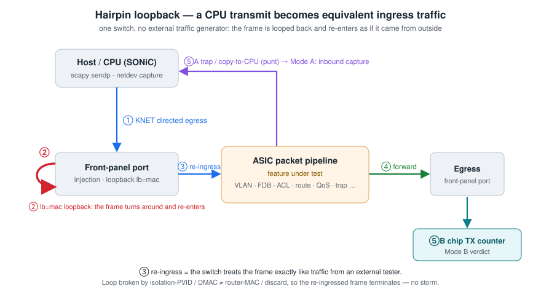

# sonic-onbox-fvt — on-switch pytest test framework for SONiC

> [中文版](docs/README.zh-CN.md) · English below

A pytest framework that runs **on the SONiC switch itself**, exercising SONiC CLI commands and
their combinations feature by feature to validate supported functionality. For anything that
programs chip tables or affects traffic, it builds a hairpin topology out of the chip's
port-internal loopback and validates the data plane with CPU-injected packets (scapy) plus chip
counters/capture — turning a single box into a test bench that needs no external traffic generator.

Chip and product differences are absorbed by an adaptation layer (`framework/cli.py`, `acl.py`,
`qos.py`, `topology/profiles.yaml`); the tests themselves are device-agnostic. Device defects are
recorded as FAIL; capabilities a device declares unsupported are structurally skipped with a reason.

## Quick start

```bash
make install                 # install deps (requirements.txt)
make check                   # syntax-compile only on the build host, no device
make smoke                   # on device: confirm the hairpin loopback path works
make run                     # on device: run everything
make run M="l2 and traffic"  # run a marker combination
```

Using pytest directly:

```bash
sudo python3 -m pytest -m smoke -v      # smoke (scapy needs root)
sudo python3 -m pytest -m l2 -v         # one feature domain
sudo python3 -m pytest tests -v         # everything
```

One-shot deploy + run from the build host: `tools/redeploy.sh "tests -v"` (pack → scp → unpack →
pytest, see `tools/dutssh.py`). On-device deployment, offline dependencies, and new-device
onboarding are in [docs/DEPLOY.md](docs/DEPLOY.md).

## Directory layout

```
framework/   core layer: dut/cli/loopback/traffic/counters/collector/verify/config_guard/
             acl/qos/dlb, etc.
catalog/     features.yaml feature-coverage catalog + coverage report; cli_inventory.json command list
tests/       pytest cases organized by feature domain (flat directory, grouped by marker)
topology/    profiles.yaml — per-device platform adaptation data (port-name mapping / diag channel /
             default VLAN / capability gating)
topo/        hairpin / netns topology construction
servers/     software peers (BGP peer, DHCP server, mock AAA/BMC)
responders/  lightweight protocol responders (ARP, collector)
tools/       dutssh.py (remote exec), redeploy.sh (deploy+run), gen_catalog.py (generate case catalog), etc.
docs/        DEPLOY.md (deploy/onboarding), TEST_CASE_CATALOG.md (per-case catalog)
plugins/     optional private plugin layer (not in the public repo, see "Plugin layer" below)
```

---

# Architecture and mechanisms

## Hairpin topology

With no external traffic generator, a single box uses the chip's port-internal loopback to turn
"a CPU-directed transmit" into "equivalent external ingress traffic":



- A frame sent from `EthernetN` is egressed by KNET on the corresponding physical port; with
  loopback enabled it turns around at the MAC layer and **re-enters as ingress, going through the
  full receive-processing pipeline** — equivalent to a traffic generator injecting test traffic on
  that port.
- The `EthernetN` ↔ physical-port mapping and the loopback mode (MAC / PHY) are declared by the
  device profile; both loopback modes send the frame back through the pipeline, are semantically
  equivalent for L2/L3 cases, and the tests are unaware of the difference.

**The core challenge is breaking the loop**: if the re-ingressing frame is still forwarded back to
the loopback port, it storms. Depending on the layer under test, three hairpin variants use
different loop-break mechanisms — all fundamentally "use asymmetry to leave the returning frame
nowhere to go":

| Variant | Topology | Loop-break mechanism | Component |
|---------|----------|----------------------|-----------|
| **L2 hairpin** | p_in ingress VLAN A, p_out ingress **VLAN B** (asymmetric VLAN) | the return frame enters B, a dead end where its dst resolves to no loopback port | `topo/hairpin.py` |
| **L3 hairpin** | p_in/p_out each with an IP, inject with DMAC=router MAC | the re-ingressing egress frame has DMAC=neighbor MAC **≠ router MAC** and is dropped at the L3 port | `framework/l3probe.py` (`TwoPortL3`) |
| **VRF hairpin** | p_in bound to **Vrf-A**, p_out bound to **Vrf-B** (asymmetric VRF) | L3 loop-break + the return frame lands in a VRF with no matching route and terminates | `framework/vrfhairpin.py` (`VrfHairpin`) |

**The VRF hairpin** is the L3 analog of the L2 asymmetric-VLAN hairpin — using different VRFs
instead of different ingress VLANs to obtain, on a single box, two routers with **mutually isolated
routing tables** (independent RIB/FIB on the control plane, independent SAI virtual_router on the
data plane). It brings to the single-box bench the L3 cases that require "more than one router /
mutually isolated routing tables":

- inter-VRF route leak, both the **positive data plane** and **per-prefix selectivity**
  (`test_vrf_route_leak_chip.py`, gated by the `vrf_route_leak` cap);
- same-prefix independent forwarding and negative cross-VRF isolation (`test_vrf_chip.py`);
- **BGP-in-VRF**: both the session and the data plane land inside one VRF (session veth enslaved to
  the VRF + `router bgp <as> vrf`), routes are learned into that VRF's RIB/FIB/ASIC and drive
  data-plane forwarding (`test_vrf_bgp_chip.py`).

## Three verification modes

| Mode | Topology | Criterion | Use for |
|------|----------|-----------|---------|
| **A** loopback port + punt to CPU | frame re-enters the pipeline via the loopback port and is trapped/redirected to CPU | inbound capture | trap/CoPP/ACL-to-CPU/ARP/LLDP |
| **B** loopback + counters | injection/egress ports each loop back, known-unicast directed forwarding | egress chip TX counter | L2/L3/LAG forwarding |
| **C** loopback + capture | B + an egress mirror-to-CPU collector | inbound capture | packet rewrite (VLAN/TTL/DSCP/MAC) |
| DB program-only | no traffic | ASIC_DB / CONFIG_DB | table-programming cases |


## Three rules

**1. Capture only proves "punted to CPU", not "forwarded".** An AF_PACKET sniffer also captures
frames the host itself sent (TX echo), so what you capture on the same port may all be your own
transmit. Therefore: always verify forwarding with chip counters (`MIB_RPKT/MIB_TPKT` from
`show c`); always filter capture to `inbound` and only use it for paths that are genuinely punted
to CPU.

**2. The loop condition is "the re-ingressing frame is still forwarded back to a loopback port",
independent of the number or type of loopback ports.** The root cause of a storm is the
topology/VLAN/dstMAC setup: a directed dst resolving to the loopback port itself (a single port is
enough to loop; same-port filtering cannot stop it), or loopback ports bouncing within a flood
domain. As long as the re-ingressing frame has somewhere to terminate (isolation PVID, an L3 port
dropping by DMAC, discard, or leaving the chip via a non-loopback port), it is safe. Break the loop
with an asymmetric PVID / isolation VLAN (`enable_flood_safe`/`isolate_pvid`) or the L3 forwarding
paradigm; run flooding cases in a dedicated small VLAN to bound the flood domain.

**3. Counter read discipline: clear → send traffic → read once.** On some platforms `show c` shows
the "delta since the last show/clear", so a before/after difference produces negative or 0 false
deltas. In slow-storm scenarios, do one confirming read after the accumulating read to guard against
false passes.

## Verification layers

- **Chip counters** `ChipCounters` (`show c`): first choice for traffic verification.
- **SAI COUNTERS_DB** `PortCounters`: cross-platform, ~1s poll latency.
- **ASIC_DB** `AsicDb`: table-programming verification (`wait_count_gt` polls the async orch).
- **CONFIG_DB/STATE_DB** `DbView`: the CLI contract. `sonic-db-cli HGETALL` output is a single-line
  dict repr and must be parsed with `ast.literal_eval`.

## Isolation and safety

- Traffic / data-plane cases run serially (loopback/FDB/ACL are global state).
- Each case's `config_guard` does a targeted rollback (records undo commands, runs them in reverse);
  a failure is only recorded and it **does not auto `config reload`** — a reload would restart
  swss/syncd, wipe loopbacks, and break the whole suite.
- Teardown disables loopbacks/collectors; a session-level backstop disables all loopbacks.
- Waiting is event-driven first: for config programming, poll the target DB key; for link/learning,
  poll oper/learn state; for counters to settle, poll accumulating reads. A fixed `sleep` is used
  only where there is no observable completion signal.

## Adaptation layer

Principle: if a manual command passes but the framework does not, first look at the `_fixup`
rewrite; probe capabilities by full option name (matching a short substring misfires on a
differently-shaped device) and cache only successful results.

- `framework/cli.py` `_fixup`: normalizes command shape (flag names / subcommand position
  differences), and on route/bridge-style OSes automatically switches `link-mode route` before
  adding an IP or binding a VRF.
- `framework/acl.py`: three-layer adaptation for table/rule/hit-count; product-CLI style goes
  through `config acl-rule` with field and TCP_FLAGS mapping; a CLI that declares no support →
  capability-gated skip; when hit counts are not rendered by the CLI, read COUNTERS_DB directly.
- `framework/qos.py`: dual paths for product-CLI configuration and community-template
  configuration; map and scheduler baseline construction; TC name↔number normalization. Decide
  "device has no QoS config" from CONFIG_DB.
- `framework/config_guard.py`: undo retried twice (heals registration-order dependencies);
  idempotent errors treated as success; `No such command` is never swallowed (that is an adaptation
  gap and must be surfaced).
- `framework/loopback.py`: `enable` waits for APPL_DB oper-up, `wait_learn_ready` waits for chip
  learning; group-level hold/release plus per-test backstop cleanup.
- Observation-channel differences (SNMP community probing, ifIndex offset, checking YANG-model
  existence before touching a GCU target table) are also absorbed in the framework layer.

Placement priority: **profiles.yaml data > cli._fixup rewrite > framework helper branch > in-test
branch** (keep it out of the tests when possible). A rewrite must be idempotent and decidable; when
unsure, pass through; an undo failure must be a visible WARNING. Keep skip vs FAIL distinct: device
declares unsupported → structural skip with the device's own message; should be supported but is not
→ FAIL with an evidence chain — never turn a FAIL into skip/xfail for the sake of a pass rate.

## Plugin layer (private, not in the public repo)

The public repo contains only the generic layer (SONiC / SAI / FRR / standard protocols).
Product-/vendor-proprietary parts are isolated into a **gitignored `plugins/` directory** that is
not published with the public repo:

| Private component | Content | Consumer |
|-------------------|---------|----------|
| `plugins/klish_map.json` / `klish_overlay.json` / `klish_xlate.py` | a proprietary modified-SONiC product's klish (Cisco-style) CLI command grammar + native↔klish translator | `framework/shell.py` |
| `plugins/chiptab.py` | Broadcom SDKLT logical-table (`bsh -c "lt ..."`) chip-value read layer | the `chip` fixture in `conftest.py` |

The framework **soft-loads** these plugins:

- **klish translation** is off by default (it takes effect only when explicitly enabled via the
  `KLISH_FLAVOR` env var or the profile cap `cli_flavor`); when off, native SONiC CLI is used and a
  missing plugin has zero effect.
- **chiptab** is loaded by the `chip` fixture at test setup via `from plugins.chiptab import
  ChipTab`; if the plugin is missing, `ImportError → pytest.skip`, so every `chiptab`-marked
  chip-value case skips as a group, gracefully.

As a result the public repo, **without** `plugins/`, still collects and runs the whole suite (only
the chip-value cases skip). To enable the private capabilities, drop those files into `plugins/`.

## Parallel lanes

Multiple pytest processes run in parallel via `tools/run_lanes.sh`: traffic workers + an observer
lane. All worker differences are absorbed in `framework/worker.py` (tests must not import it); tests
are unaware:

- **Port blocks**: each worker's candidate port set comes from `workers[N].ports` in
  `profiles.yaml`; every role draws from that single set.
- **Private flood domain**: an additional worker's role ports are moved as a whole into a private
  VLAN, avoiding a permanent storm when two bare loopback ports in different processes share a VLAN
  and any kernel noise multicast bounces between them.
- **Resource view offset**: VLAN id / subnet / route / loopback / hairpin params / BGP AS / netns
  name are offset per worker, so the two lanes' resource sets are statically disjoint.
- **Narrowed cleanup primitives**: clearing counters/FDB/loopback is scoped to the group's range;
  global singletons (config save/reload, counterpoll, CoPP, CRM, AAA, service restarts) are done
  once by the orchestrator before the parallel phase, or in the serial tail.

## Device mechanism facts

- **Flood-domain size is the root cause of whole-box degradation**: continuous flooding in a large
  VLAN drags down loopback/learning/aging; flooding cases always run in a dedicated small VLAN.
- **Forwarding to a loopback port self-loops into a storm**; same-port filtering cannot break a
  dst→self loop; loop-break relies on isolation PVID / L3 drop / discard, independent of the number
  of loopback ports. With ≥2 bare loopback ports in one VLAN, any kernel noise multicast (IPv6 ND)
  can loop forever — use flood_safe on measurement ports or disable_ipv6 during the test window.
- **Loopback link-up has jitter** (APPL_DB oper → kernel carrier, a two-stage gate), and after
  oper-up the bridge-port admin recovers asynchronously: wait for carrier before sending, and
  wait for learning readiness for learning cases.
- **Counter/config models differ per platform**: differences such as the counter delta semantics
  and the product-CLI configuration style (TC stored by name, acl-rule must go through product
  commands, the homing primitive for a protected default VLAN) are all described by the profile +
  adaptation layer, and tests gate on them.

---

## Feature coverage

Each feature domain is organized by four verification depths, going beyond "the command did not
error": ① config → CONFIG_DB contract  ② orchagent → APPL/ASIC_DB programming  ③ chip truth (diag
tables/counters)  ④ data-plane traffic (loopback injection → chip counter/capture judgment).

| Domain | Coverage |
|--------|----------|
| L2 switching | VLAN lifecycle and member semantics, FDB static/dynamic learning and MAC move, LAG/LACP, hairpin self-check, storm control / MTU |
| L3 routing | interface/RIF, static and floating routes, ARP/ND neighbors, end-to-end forwarding and ECMP distribution, VRF isolation and inter-VRF route leak (data plane), PBR |
| Routing protocols | BGP (software peer builds session, closed-loop to RIB/FIB/ASIC), BGP-in-VRF (session + data plane both in a VRF), OSPF, BFD, routing-policy CLI |
| ACL | L3/L2/egress table and rule lifecycle, per-field programming, DROP/FORWARD actions with hit counts, data-plane blocking |
| QoS | DSCP/dot1p classification maps, queue scheduling (SP/DWRR/WRED/ECN), buffer pool/profile/PG, PFC/PFCWD, DLB |
| CoPP / punt | per-trap-type punt to CPU, policer rate objects and per-trap statistics |
| Mirror / sampling | SPAN/ERSPAN sessions and mirror-copy counting, sFlow sampling |
| Stats / telemetry | counter accuracy (send N receive N ± tolerance), CRM conservation and thresholds, gNMI subscription |
| Tunnels | VXLAN VTEP/VNI mapping programming + encap/decap data plane |
| Platform / system mgmt | optics/fan/PSU/temperature-voltage, SNMP full-MIB value-vs-DB, AAA/SSH/NTP/syslog, DHCP relay |
| CLI full regression | every `show` runs without crashing, every `config --help` wires correctly |
| SAI object ledger | required init objects present + per-class programming of new objects triggered by config/traffic/protocol |

The per-case list is in [docs/TEST_CASE_CATALOG.md](docs/TEST_CASE_CATALOG.md); the feature-coverage
matrix is driven by `catalog/features.yaml` and emitted by `make coverage`.

## Test scope

- **Not covered** (unsupported by the product or beyond single-box capability): IGMP snooping and
  L2/L3 multicast, the full STP suite, subinterfaces, VRRP, FRR-template cases that need a real BGP
  peer topology, and physically-limited cases that need a traffic generator / real peer (LAG hash
  distribution, aggregate failover, OSPF/BFD adjacency, QoS congestion observation).
- **Covered**: multicast-SMAC drop, BUM storm control (security-class, not multicast forwarding).

## License

MIT — see [LICENSE](LICENSE).
