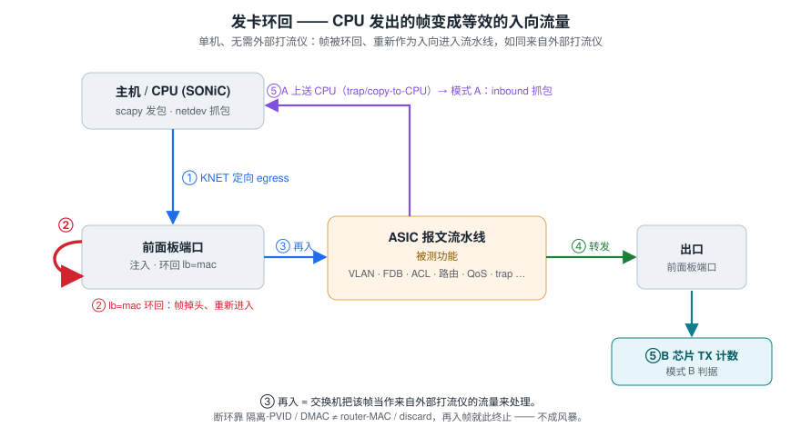

# sonic-onbox-fvt —— SONiC 交换机本机 pytest 测试框架

> [English](../README.md) · 本文为中文版

在 SONiC 交换机**本机**运行的 pytest 框架，按功能点逐个执行 SONiC 命令行及组合，验证
受支持的功能。凡会下发芯片表项、影响流量的功能，用芯片端口内部环回搭发卡拓扑，以 CPU
发包（scapy）+ 芯片计数/抓包做数据面验证，把单机变成一个无需外部打流仪的测试台。

芯片与产品形态的差异集中在适配层（`framework/cli.py`、`acl.py`、`qos.py`、
`topology/profiles.yaml`）处理，用例本身不感知设备差异。设备缺陷记为 FAIL；能力不具备的
项按设备声明结构性 skip 并带原因。

## 快速开始

```bash
make install                 # 装依赖（requirements.txt）
make check                   # build 机纯语法编译，不连设备
make smoke                   # 上机冒烟：确认发卡环回链路通
make run                     # 上机跑全部
make run M="l2 and traffic"  # 按 marker 跑某组合
```

直接用 pytest：

```bash
sudo python3 -m pytest -m smoke -v      # 冒烟（scapy 需 root）
sudo python3 -m pytest -m l2 -v         # 某功能域
sudo python3 -m pytest tests -v         # 全部
```

从 build 机一键部署+运行：`tools/redeploy.sh "tests -v"`（打包 → scp → 解压 → pytest，
见 `tools/dutssh.py`）。上机部署、离线依赖、新设备接入见 [DEPLOY.md](DEPLOY.md)。

## 目录结构

```
framework/   核心层：dut/cli/loopback/traffic/counters/collector/verify/config_guard/
             acl/qos/dlb 等
catalog/     features.yaml 功能点覆盖目录 + coverage 报告；cli_inventory.json 命令清单
tests/       按功能域组织的 pytest 用例（扁平目录，用 marker 分组）
topology/    profiles.yaml —— 各设备的平台适配数据（口名映射/诊断通道/默认 VLAN/能力门控）
topo/        发卡/netns 拓扑构造
servers/     软件对端（BGP peer、DHCP server、mock AAA/BMC）
responders/  轻量协议应答器（ARP、采集器）
tools/       dutssh.py（远程执行）redeploy.sh（部署运行）gen_catalog.py（生成用例目录）等
docs/        DEPLOY.md（部署/接入）、TEST_CASE_CATALOG.md（逐用例目录）
plugins/     可选私有插件层（不在公开仓库，见下文「插件层」）
```

---

# 架构与机制

## 发卡拓扑

单机无外部打流仪，靠芯片端口内部环回把"CPU 定向发包"变成"等效外部进流量"：



- 从 `EthernetN` 发出的帧被 KNET 定向从对应物理口 egress；开环回后帧在 MAC 层掉头，
  **重新作为 ingress 走完整收包处理流程**，等效于外部打流仪从该口打入测试流量。
- `EthernetN` ↔ 物理口映射、环回模式（MAC / PHY）由设备 profile 声明；两种环回都把帧送回
  流水线，对 L2/L3 用例语义等价、用例不感知。

**核心难点是断环**：再入帧若仍被转发回环回口就成环风暴。按被测层次，用不同"断环"机制得到
三种发卡变体——本质都是"用不对称性让返回帧无处可去"：

| 变体 | 拓扑 | 断环机制 | 构件 |
|------|------|----------|------|
| **L2 发卡** | p_in 入向 VLAN A、p_out 入向 **VLAN B**（非对称 VLAN） | 返回帧进 B 死路，dst 不在 B 解析到任何环回口 | `topo/hairpin.py` |
| **L3 发卡** | p_in/p_out 各配 IP，注入 DMAC=router MAC | 出口再入帧 DMAC=邻居MAC**≠router MAC**，在 L3 口被丢 | `framework/l3probe.py`（`TwoPortL3`） |
| **VRF 发卡** | p_in 绑 **Vrf-A**、p_out 绑 **Vrf-B**（非对称 VRF） | L3 断环 + 返回帧落进无对应路由的 VRF 自然终止 | `framework/vrfhairpin.py`（`VrfHairpin`） |

**VRF 发卡**是 L2 非对称-VLAN 发卡的三层对应物——用不同 VRF 取代不同入向 VLAN，在一台设备上
得到两台**路由表相互隔离**的路由器（控制面独立 RIB/FIB，数据面独立 SAI virtual_router）。
它把"需要一台以上路由器/相互隔离的路由表"才能表达的三层用例带上单机测试台：

- 跨 VRF 路由泄漏的**正向数据面**与**按前缀选择性**（`test_vrf_route_leak_chip.py`，`vrf_route_leak` cap 门控）；
- 同前缀独立转发、跨 VRF 隔离负向（`test_vrf_chip.py`）；
- **VRF 内 BGP**：会话与数据面都落进一个 VRF（会话 veth enslave 进 VRF + `router bgp <as> vrf`），
  路由学进该 VRF 的 RIB/FIB/ASIC 并驱动数据面转发（`test_vrf_bgp_chip.py`）。

## 三种验证模式

| 模式 | 拓扑 | 判据 | 适用 |
|------|------|------|------|
| **A** 环回口 + 送 CPU | 帧经环回口再入流水线，被 trap/redirect 到 CPU | inbound 抓包 | trap/CoPP/ACL-to-CPU/ARP/LLDP |
| **B** 环回 + 计数 | 注入口/出口各开环回，已知单播定向转发 | 出口芯片 TX 计数 | L2/L3/LAG 转发 |
| **C** 环回 + 抓包 | B + 出口 mirror-to-CPU 采集器 | inbound 抓包 | 报文改写（VLAN/TTL/DSCP/MAC） |
| DB 纯下发 | 无流量 | ASIC_DB / CONFIG_DB | 表项下发类 |


## 三条约定

**1. 抓包只能证明"被 punt 到 CPU"，不能证明"转发"。** AF_PACKET 嗅探器会把本机发出的帧
（TX 回声）也抓回，同口抓到的可能全是自己发的。故：转发验证一律用芯片计数器
（`show c` 的 `MIB_RPKT/MIB_TPKT`）；抓包一律 `inbound` 过滤，且只用于真正 punt 到 CPU
的路径。

**2. 成环条件是"再入帧仍会被转发回环回口"，与环回口数量/类型无关。** 风暴根因是
拓扑/VLAN/dstMAC 设置：定向 dst 解析到环回口自身（单口即可成环，同口过滤挡不住），或
泛洪域内环回口互弹。只要再入帧有终结去处（隔离 PVID、L3 口按 DMAC 丢弃、discard、从非
环回口离开芯片）即安全。断环用非对称 PVID/隔离 VLAN（`enable_flood_safe`/`isolate_pvid`）
或 L3 转发范式；泛洪类用例跑在专用小 VLAN 限定泛洪域。

**3. 计数器读法：clear → 打流 → 读一次。** 部分平台 `show c` 是"距上次 show/clear 的
变化量"语义，before/after 差值法会产出负值/0 假 delta。慢速风暴场景在累加读之后需再做一次
确认读，防假通过。

## 验证层

- **芯片计数器** `ChipCounters`（`show c`）：流量验证首选。
- **SAI COUNTERS_DB** `PortCounters`：跨平台，约 1s 轮询延迟。
- **ASIC_DB** `AsicDb`：表项下发验证（`wait_count_gt` 轮询异步 orch）。
- **CONFIG_DB/STATE_DB** `DbView`：命令行契约。`sonic-db-cli HGETALL` 输出是单行 dict
  repr，需 `ast.literal_eval` 解析。

## 隔离与安全

- 打流/数据面用例串行执行（loopback/FDB/ACL 是全局态）。
- 每用例 `config_guard` 做定向回滚（记录 undo 命令逆序执行），失败仅记录，**不自动
  `config reload`**——reload 会重启 swss/syncd、清掉 loopback、中断整套用例。
- teardown 关 loopback/采集器；会话级兜底关掉所有 loopback。
- 等待以事件驱动优先：等配置编程轮询 DB 目标键、等链路/学习轮询 oper/学习位、等计数落定
  轮询累加读数；固定 `sleep` 只用于无可观测完成信号的场合。

## 适配层

原则：手工命令能过而框架不过 ⇒ 先查 `_fixup` 改写；能力探测按选项全名判定（匹配短串会在
另一形态设备上误判）、且只缓存成功结果。

- `framework/cli.py` `_fixup`：命令形态归一化（标志名/子命令位置差异），以及 route/bridge
  型 OS 在配 IP、绑 VRF 前自动切 `link-mode route`。
- `framework/acl.py`：建表/建规则/命中计数三层自适应；产品 CLI 制走 `config acl-rule`，
  字段与 TCP_FLAGS 映射；CLI 声明不支持 → 能力门控 skip；命中数在 CLI 不渲染时直读
  COUNTERS_DB。
- `framework/qos.py`：产品 CLI 配置制与社区模板制双通道；映射与调度 baseline 构造；TC
  名字↔数字归一化。判"设备无 QoS 配置"看 CONFIG_DB。
- `framework/config_guard.py`：undo 二次重试（治愈注册顺序依赖）；幂等报错按成功；
  `No such command` 永不吞（那是适配缺口，必须暴露）。
- `framework/loopback.py`：`enable` 等 APPL_DB oper-up，`wait_learn_ready` 等芯片学习位；
  组级 hold/release 配合 per-test 兜底清理。
- 观测通道差异（SNMP community 探活、ifIndex 偏移、GCU 目标表先查 YANG 存在性）也在框架层
  吸收。

落点优先级：**profiles.yaml 数据 > cli._fixup 改写 > framework 助手分支 > 用例内分支**
（能不进用例就不进）。改写需幂等可判定，不确定就透传；undo 失败必须 WARNING 可见。门控
skip 与 FAIL 分明：设备声明不支持 → 结构性 skip 带原文；应支持而没做到 → FAIL 带证据链，
不因通过率把 FAIL 改 skip/xfail。

## 插件层（私有，不在公开仓库）

公开仓库只含通用层（SONiC / SAI / FRR / 标准协议）。产品/厂商专有的部分被隔离到一个
**gitignore 掉的 `plugins/` 目录**，不随公开仓库发布：

| 私有构件 | 内容 | 消费方 |
|----------|------|--------|
| `plugins/klish_map.json` / `klish_overlay.json` / `klish_xlate.py` | 某专有改造版 SONiC 产品的 klish（Cisco 式）CLI 命令语法 + 原生↔klish 翻译器 | `framework/shell.py` |
| `plugins/chiptab.py` | Broadcom SDKLT 逻辑表（`bsh -c "lt ..."`）芯片真值读取层 | `conftest.py` 的 `chip` fixture |

框架**软加载**这些插件：

- **klish 翻译**默认关闭（`KLISH_FLAVOR` 环境变量或 profile cap `cli_flavor` 显式开启才生效）；
  未开启时走原生 SONiC CLI，插件缺失零影响。
- **chiptab** 由 `chip` fixture 在用例 setup 阶段 `from plugins.chiptab import ChipTab`；插件缺失
  时 `ImportError → pytest.skip`，即所有 `chiptab` marker 的芯片真值用例整组优雅跳过。

因此公开仓库在**没有** `plugins/` 的情况下仍能完整收集全部用例并运行（只是芯片真值层用例
skip）。要启用私有能力，把上述文件放进 `plugins/` 即可。

## 并行车道

多 pytest 进程并行，入口 `tools/run_lanes.sh`：打流 worker + 观察道。worker 差异全部在
`framework/worker.py` 吸收（用例不得 import 它），用例零感知：

- **端口块**：各 worker 的候选端口集来自 `profiles.yaml` 的 `workers[N].ports`，所有角色
  从这一个口集流出。
- **私有泛洪域**：附加 worker 的角色口整体搬进私有 VLAN，避免跨进程两个裸环回口同 VLAN 时
  被内核噪声组播打成永续风暴。
- **资源视图偏移**：VLAN id/子网/路由/loopback/发卡参数/BGP AS/netns 名按 worker 偏移，
  两道资源集静态不相交。
- **清理原语收窄**：清计数/FDB/环回都限定在本组范围；全局单例（config save/reload、
  counterpoll、CoPP、CRM、AAA、服务重启类）由编排器在并行相之前统一做，或落到串行尾。

## 设备机制事实

- **泛洪域大小是整机退化根因**：在大 VLAN 里连打泛洪会拖垮环回/学习/老化；泛洪类用例一律
  跑专用小 VLAN。
- **转发到环回口会自循环风暴**，同口过滤断不了 dst→self 环；断环靠隔离 PVID/L3 丢弃/
  discard，与环回口数量无关。同 VLAN ≥2 个裸环回口时，任意内核噪声组播（IPv6 ND）即可
  永续循环——测量口用 flood_safe 或测试窗口 disable_ipv6。
- **环回 link-up 有抖动**（APPL_DB oper → 内核 carrier 两级门），且 oper-up 后桥端口 admin
  异步恢复：发包前等 carrier，学习类再等学习位就绪。
- **计数器/配置模型因平台而异**：计数器变化量语义、产品 CLI 配置制（TC 存名字、acl-rule 必经
  产品命令、受保护默认 VLAN 的归位原语）等差异均由 profile + 适配层描述，用例据此门控。

---

## 功能覆盖

每个功能域按四级验证深度组织，不止于"命令不报错"：① config → CONFIG_DB 契约　②
orchagent → APPL/ASIC_DB 编程　③ 芯片真值（诊断表项/计数器）　④ 数据面流量（环回注入 →
芯片计数/抓包判定）。

| 功能域 | 覆盖 |
|--------|------|
| L2 交换 | VLAN 生命周期与成员语义、FDB 静态/动态学习与 MAC move、LAG/LACP、发卡拓扑自验、风暴抑制/MTU |
| L3 路由 | 接口/RIF、静态路由与浮动路由、ARP/ND 邻居、端到端转发与 ECMP 分布、VRF 隔离与跨表路由泄漏（数据面）、PBR |
| 路由协议 | BGP（软件对端建会话到 RIB/FIB/ASIC 闭环）、VRF 内 BGP（会话+数据面均在 VRF）、OSPF、BFD、路由策略 CLI |
| ACL | L3/L2/egress 表与规则生命周期、逐字段下发、DROP/FORWARD 动作与命中计数、数据面拦截 |
| QoS | DSCP/dot1p 分类映射、队列调度（SP/DWRR/WRED/ECN）、buffer pool/profile/PG、PFC/PFCWD、DLB |
| CoPP / 上送 | 逐 trap 类型上送 CPU、policer 限速对象与 per-trap 统计 |
| 镜像/采样 | SPAN/ERSPAN 会话与镜像副本计数、sFlow 采样 |
| 统计/遥测 | 计数准确性（发 N 收 N±容差）、CRM 守恒与阈值、gNMI 订阅 |
| 隧道 | VXLAN VTEP/VNI 映射编程 + encap/decap 数据面 |
| 平台/系统管理 | 光模块/风扇/PSU/温压、SNMP 全 MIB 值-vs-DB、AAA/SSH/NTP/syslog、DHCP relay |
| CLI 全量回归 | 每条 show 执行不崩溃、每条 config --help 正确接线 |
| SAI 对象台账 | 初始化必备对象在位 + 配置/流量/协议触发的新对象逐类编程验证 |

逐用例清单见 [TEST_CASE_CATALOG.md](TEST_CASE_CATALOG.md)；功能点覆盖矩阵由
`catalog/features.yaml` 驱动，`make coverage` 输出。

## 测试范围

- **不覆盖**（产品不支持或超出单机能力）：IGMP snooping 与二三层组播、STP 全套、子接口、
  VRRP、需真实 BGP 对端拓扑的 FRR 模板用例、需流量仪/真实对端的物理限制类（LAG hash 分担、
  聚合倒换、OSPF/BFD 邻接、QoS 拥塞观测）。
- **覆盖**：multicast-SMAC 丢弃、BUM 风暴抑制（安全类，非组播转发功能）。

## 许可证

MIT，见 [LICENSE](../LICENSE)。
